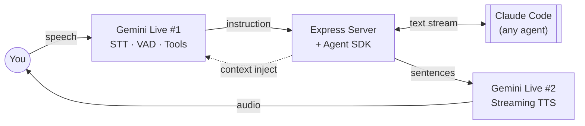
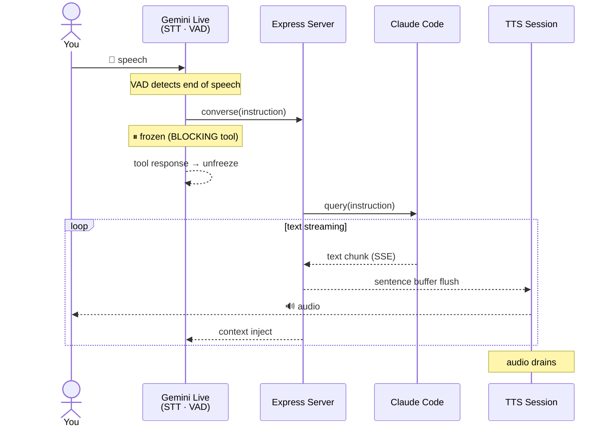

# Duck Talk

Talk to Claude Code. Hear it talk back. Approve, interrupt, or redirect — all by voice, from anywhere.

The core tech: a generic a voice layer that can wrap **any** black-box agent using Live Speech models (e.g. Gemini Live, OpenAI Realtime) for low latency conversations. No modifications to the agent.

```
             Duck Talk            Claude Code
              ┌──────┐          ╔══════════════╗
You ─speech─▶ │ STT  │ ─inst─▶  ║              ║
    ◀─audio── │ TTS  │ ◀─txt──  ║  (any agent) ║
              └──────┘          ╚══════════════╝

inst = instruction, e.g. "What is the latest PR?"
txt = raw stream of tokens 
```

## Demo


## Quick start

You will need:

- [Claude Code CLI](https://docs.anthropic.com/en/docs/claude-code) on PATH
- [`ANTHROPIC_API_KEY`](https://console.anthropic.com/) — for Claude Code
- [`GOOGLE_API_KEY`](https://aistudio.google.com/apikey) — for Gemini voice (free tier works, no credit card needed)

```bash
git clone https://github.com/dhuynh95/claude_talks.git && cd claude_talks
npm install

# Set up your keys
cp .env.example .env
# Edit .env with your API keys

npm run dev
# Opens http://localhost:8000
```

## Why

I wanted a coding assistant I could talk to on a walk — check on
a long-running task, brainstorm architecture, review a plan.
Hands-free, conversational, no laptop required.

STT tools like [SuperWhisper](https://superwhisper.com/) and
[Wispr Flow](https://wisprflow.ai/) get you halfway — you can
dictate, but the agent never talks back. You can bolt TTS onto
Claude Code via MCP, but you're waiting for the full response
before hearing anything.

Voice-native agents like ChatGPT and Gemini Live have the
conversation part down, but they're not connected to your codebase.
They can't run commands, edit files, or see your project. And if
your accent trips up the STT — "Cloud Code" instead of
"Claude Code" — there's no way to catch it before it's sent.

Nothing combines all of this:

|  | Multi turn voice | Audio output | Low latency | No context bloat | Setup |
|---|---|---|---|---|---|
| **STT dictation** | ❌ Push-to-talk | ❌ | ❌ No response | ✅ | ✅ |
| **MCP voice tool** | ❌ Keyboard | ✅ | ❌ After completion | ❌ Extra MCP | ❌ Custom MCP |
| **Duck Talk** | ✅ | ✅ | ✅ | ✅ | ✅ |

## Key features

- **Real-time voice** — talk to Claude Code hands-free. Say "stop" to interrupt mid-response.
- **Streaming TTS** — responses spoken sentence-by-sentence as they stream. ~1.5s to first audio, not after completion.
- **Review mode** — hear your instruction read back before it's sent. Accept, edit, or reject by voice or buttons. No more "Cloud Code" when you said "Claude Code."
- **Correction learning** — edit a misheard instruction, the diff is saved. Future transcriptions auto-correct.
- **Session management** — browse, resume, and rewind conversations. Built on Claude Code's native JSONL format.

## Architecture

Two Gemini Live sessions — one listens, one speaks. Claude Code
is the black box in between.



**Flow of a single instruction:**



## License

[MIT](LICENSE)
